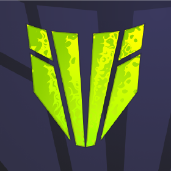

<h1 align="center"> 🌟DualZone 🌟 </h1>

<h5 align="center">  Bienvenue sur DualZone, la plateforme COMPÉTITIVE de rêve pour les joueurs de Counter-Strike 2 (CS2) ! 💥 Ici, tu vas t’éclater dans des affrontements 1v1 et 2v2, avec un matchmaking équilibré et des outils super cool pour faire briller la communauté ! 🌟 </h5>

---

## 🎮 **Description du projet** 🎮

**DualZone** est l’endroit parfait pour les fans de CS2 qui veulent vivre une expérience compétitive fluide et excitante ! 🔥 Que tu sois un joueur casual cherchant à améliorer tes skills ou un compétiteur prêt à gravir les échelons du classement, **DualZone** est là pour toi ! 💪

### 🏆 **Modes de jeu disponibles** 🏆
- **1v1 Duel** : Mets tes réflexes et ta précision à l’épreuve dans des duels intenses ! 🎯
- **2v2 Match** : Forme une équipe avec un pote et menez des batailles stratégiques à couper le souffle ! 🤜🤛

### ⭐ **Caractéristiques principales** ⭐
- **Matchmaking super précis** : Trouve des adversaires à ta hauteur grâce à un classement Elo qui met tout le monde sur un pied d’égalité ! ⚖️
- **Parties personnalisées** : Crée et rejoins des parties privées avec tes amis pour des moments de jeu inoubliables ! 🎉
- **Classements compétitifs** : Suis ta progression et compare tes performances avec les meilleurs joueurs ! 📊
- **Communauté fun et engagée** : Ajoute des amis, forme des équipes et rejoins une communauté bienveillante et animée ! 🤩

---

## 🚀 **Pourquoi choisir DualZone ?** 🚀

### Pour les joueurs :
- **Des matchs équilibrés** : Profite de parties avec des joueurs de ton niveau pour un défi de taille ! 💥
- **Une progression claire** : Vois ta montée en puissance à travers notre système de classement transparent ! 📈
- **Une communauté active** : Rejoins une bande de passionnés de CS2 dans un environnement fun et compétitif ! 🕹️

### Pour les partenaires :
- **Un projet innovant** : DualZone, la plateforme unique dédiée aux formats 1v1 et 2v2, parfaite pour des compétitions sur mesure ! 🔥
- **Un travail de qualité** : Nous avons conçu DualZone pour offrir une expérience utilisateur moderne et fluide ! ⚙️

---

## 🌐 **Comment rejoindre la plateforme ?** 🌐

1. Va sur notre site officiel : [dualzone.gg](https://dualzone.gg) 🌍
2. Connecte-toi avec ton compte Steam 🎮
3. Lance une recherche de match ou crée une partie privée avec tes amis ! 🙌

Et n'oublie pas de rejoindre notre communauté sur Discord pour rester à jour avec les dernières nouveautés et événements ! 🎉 [Discord DualZone](https://discord.gg/NUejqEbYq4)

---

## 📬 **Contact** 📬

Si tu as des questions ou des suggestions, n’hésite pas à nous contacter :

- **Site Web** : [dualzone.gg](https://dualzone.gg) 🌐
- **Discord** : [Rejoindre notre communauté](https://discord.gg/NUejqEbYq4) 💬

---

## 👥 **Membres** 👥

[gruv0o](https://github.com/gruv0o), [ManMaz](https://github.com/ManMazFr), [Simon Lou](https://github.com/SimonLou-Dev) & [xEd-N](https://github.com/xEd-N)

---

Merci de ton intérêt pour **DualZone** ! 🙏 Nous avons hâte de te voir en jeu et de construire ensemble une communauté de joueurs passionnés et fun ! 🎮✨
